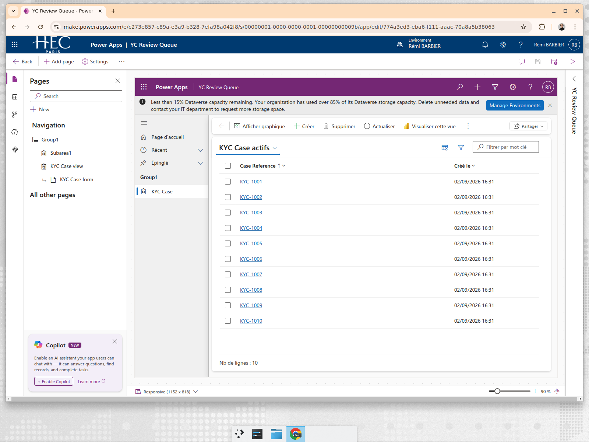
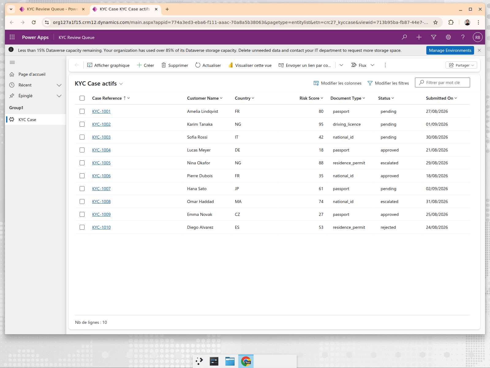
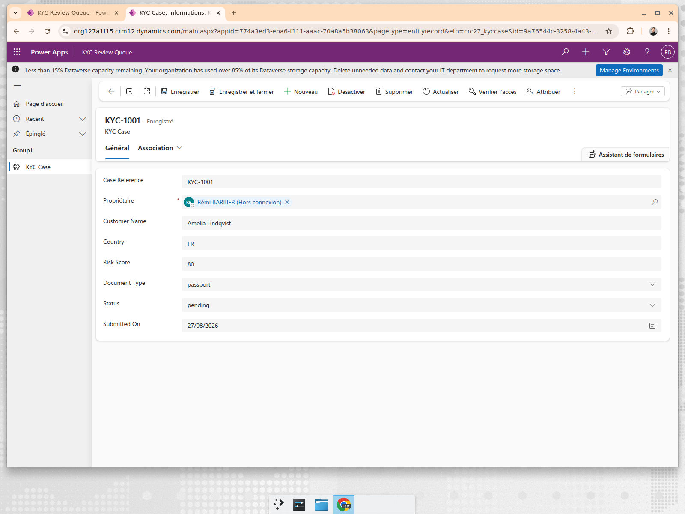

# What Power Apps actually gave us in 20 minutes

We did not evaluate Power Apps from documentation. We built the same use case — a KYC review
queue — in a live Power Apps tenant (Dataverse, model-driven app) and timed it. This is what we
observed, so the comparison below is first-hand rather than inferred.

## What we built there

A 10-row KYC case list (`Case Reference`, `Customer Name`, `Country`, `Risk Score`,
`Document Type`, `Status`, `Submitted On`) imported from CSV, which Power Apps mapped into a
Dataverse table, then a generated model-driven app published to the tenant.

Elapsed time: about 20 minutes, most of it waiting on Dataverse provisioning and publish.

## What it gave us for free, and we did not build

- A typed table with generated views and forms, sortable columns, keyword filter, column and
  filter editors exposed to the end user at runtime.
- Per-record ownership, record sharing, an "check access" command, and assignment — record-level
  security primitives that come from Dataverse, not from the app.
- Entra ID identity, hosting, backup, and Microsoft's compliance posture.
- Entry points to Power Automate flows and "visualize this view in Power BI" from the same toolbar.
- Choice columns inferred from the CSV values (`Status`, `Document Type` became option sets).

Our prototype does not attempt any of this. Our authentication is a demo cookie, our data layer is
SQLite, and there is no reporting or automation surface.

## What it did not give us, and matters for fintech

- **No maker-checker by default.** The generated app lets a single user edit `Status` on a KYC
  case and save. Enforcing "an analyst proposes, a different approver executes" requires extra
  solution components such as Dataverse columns, Power Automate flows and business rules. Those
  controls can be packaged and reused, but they are additional design work rather than a property
  of the generated form.
- **No action-level audit of intent.** Dataverse auditing (when enabled) records field changes. It
  does not record a denied attempt, a proposal, or who approved what and why. Our `AuditLog` records
  `denied`, `proposed`, `approved` and `executed` for every action, with before/after snapshots.
- **Governance is per-record, not per-action.** Security roles and record ownership answer "who can
  see or edit this row", not "who may approve a refund above 500 EUR".
- **Storage is a live constraint.** The tenant surfaced a permanent banner: less than 15% Dataverse
  capacity remaining. Capacity therefore deserves separate modelling rather than being inferred
  from seat count.
- **Locale is not app-scoped.** The maker portal renders in English while the published app renders
  in French (`Enregistrer`, `Nb de lignes`, `Actualiser`) because it follows the user's tenant
  language. Mixed-language internal tooling is not something the app author controls cheaply.
- **Reviewability is available, not automatic.** Power Platform solutions can be exported or
  synchronized to Git, represented as source-controlled YAML, promoted through pipelines and
  tested with Test Studio ([source control](https://learn.microsoft.com/en-us/power-platform/alm/use-source-control-solution-files), [Test Studio](https://learn.microsoft.com/en-us/power-apps/maker/canvas-apps/test-studio)). The 20-minute maker path did not create that ALM discipline for us;
  it has to be established and enforced. Conventional application code still produces a more
  direct and familiar review surface for this engineering team.

## Delegation nuance

The [500-row default (2,000 maximum)](https://learn.microsoft.com/en-us/power-apps/maker/canvas-apps/delegation-overview) applies when a **canvas app** uses a Power Fx expression that
cannot be delegated to its data source. It can produce incomplete results and is a genuine
correctness risk, but Power Apps Studio surfaces delegation warnings and well-designed queries can
avoid it. The model-driven Dataverse list built for this comparison uses server-side views, so its
result set should not be presented as subject to the same client-side truncation.

## Honest read

For the shape of app we built — a list, a form, a status field — Power Apps is faster than us and
will stay faster. Twenty minutes with no code, and the end user gets column and filter editing we
would have to build.

The moment the requirement is "this decision needs two people and a defensible trail", the
generated form is no longer the whole solution. Power Platform can still implement the control,
but it requires deliberate ALM and workflow design. That is the line in `KEY_DECISIONS.md`: keep
Power Apps where maker autonomy and platform services dominate; pilot owned code where custom
controls, engineering review and repeatability dominate.
